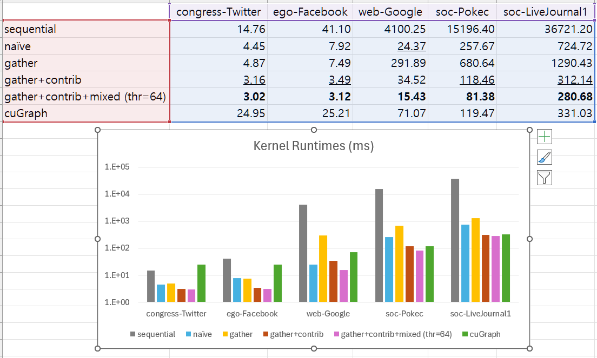

# PageRankCUDA

Parallel and Optimized PageRank with CUDA

Done as a class project in *M3239.005400 Computing for Data Science 2, Fall 2025*

## Environment
- Intel Xeon Gold 6342, NVIDIA GeForce RTX 3090
- CUDA 13.0, `cugraph-cu13=25.10.1`, Python 3.12.3

## Results

<p align="center">
    
</p>

## Setup

Install cuGraph
```sh
pip install cugraph-cu13 --extra-index-url=https://pypi.nvidia.com
```

Clone the repository
```sh
git clone https://github.com/zenith82114/PageRankCUDA.git
cd PageRankCUDA
```

Prepare data
```sh
mkdir data
cd data
wget https://snap.stanford.edu/data/congress_network.zip \
    https://snap.stanford.edu/data/facebook_combined.txt.gz \
    https://snap.stanford.edu/data/web-Google.txt.gz \
    https://snap.stanford.edu/data/soc-pokec-relationships.txt.gz \
    https://snap.stanford.edu/data/soc-LiveJournal1.txt.gz
unzip congress_network.zip
gzip -d *.txt.gz
cd ..
```

Preprocess data (this removes headers and sets vertex indexing to 0-based)
```sh
mkdir test
python preprocess.py
```

Compile binaries (`out/` directory will be generated)
```sh
make
```

Run programs
```sh
./run.sh congress_network
```

For `./run.sh [GRAPH]` you need to have `test/[GRAPH].in` which is in the following format:
```
N M
u[0] v[0]
...
u[M-1] v[M-1]
```
